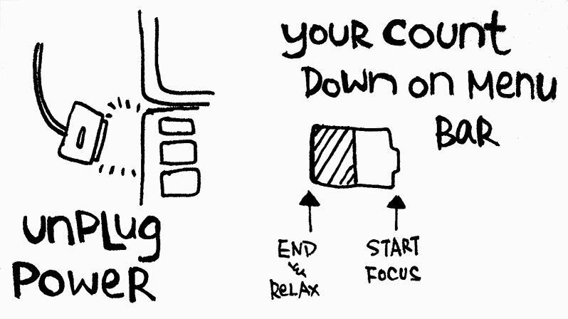

I’m using a technique to boost my efficiency within 2 hours to get things done. The method is to unplug the A/C power of my notebook.

The principle is to let the battery become the count down timer for the task that you are working on. The goal is to finish the task on hand before the notebook runs out of battery. When the battery is gradually dropping its percentage, I closed all my social network applications / websites and stick on the project. Pushing my brain to focus on how to complete it.

The goal is to finish the task on hand before the notebook runs out of battery For example, I was going to make a mini game for a web design project in a Sunday. I planned the game in my mind when I was having lunch. Then I Launched Flash and unplug the A/C power of my Macbook. I started the development. I planned to use the whole afternoon to finish the mini-game and at last I finished it within 2 hours. My brain keeps outputting high-quality programming code during that 2 hours and my hands keep moving between different keyboard shortcuts. The situation is like a world champion pro gamer playing Warcraft. Their hands are non-stop in the competition.

After finishing that mini games. I plug the A/C power back and closed the lid of the notebook. Take a short break and then prepared and planned the next tasks in my sketch book. And then rushing for another battery challenge.

This method can make people tired if you keep rushing on the project. Therefore, I used them once or twice a week now to get my most important things done. Hope that this method works for you too and it is welcome to share you opinions on how to getting focus in getting things done.