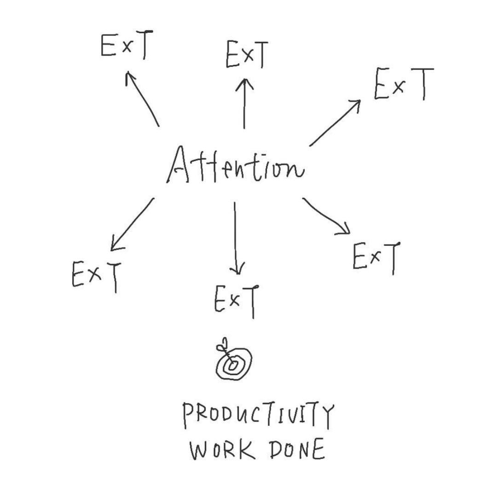

It is the **attention** that drives our daily life. The attention drives the flow of **energy** on our our limited **time**.

**Work done = Energy x Time**

**Work done ≠ Productivity Work done**

**Work done towards Goal = Productivity**

Our attention shifts from time to time. The attention drives where our energy goes. Over time, our energy output creates work done.

If our attention aligns with our goal, our work done aligns with our goal. This is what I call **Productivity Work done**. Otherwise, our energy produces work that is just a distraction from our real goal. That’s why **Work done ≠ Productivity Work done**. And our attention determines if our direction of energy is correct.

—Thomas Mak, 2020-03-05.